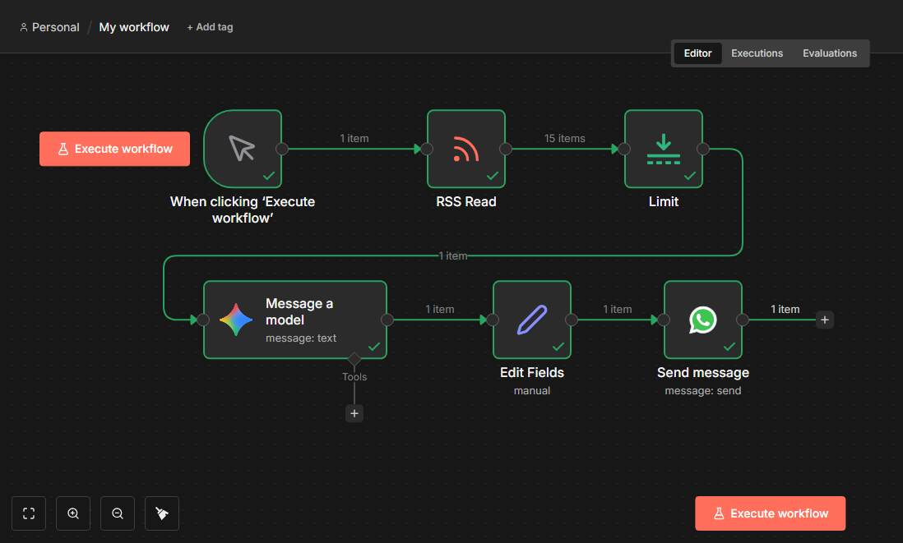
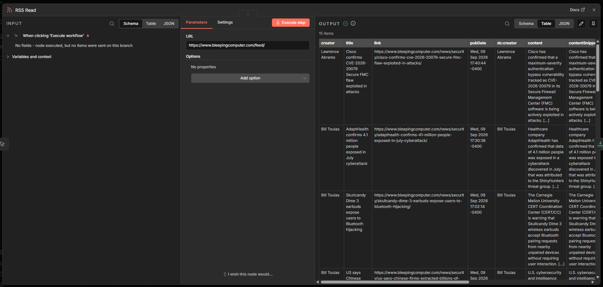
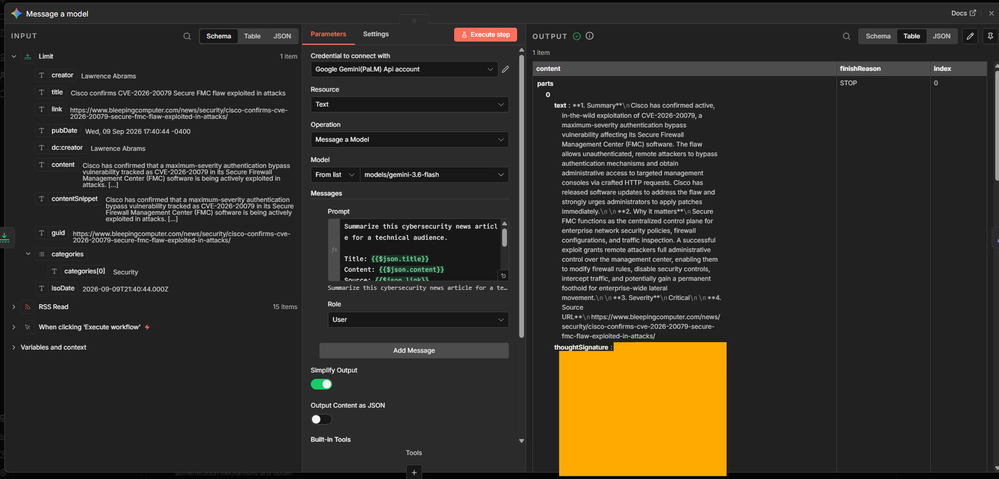
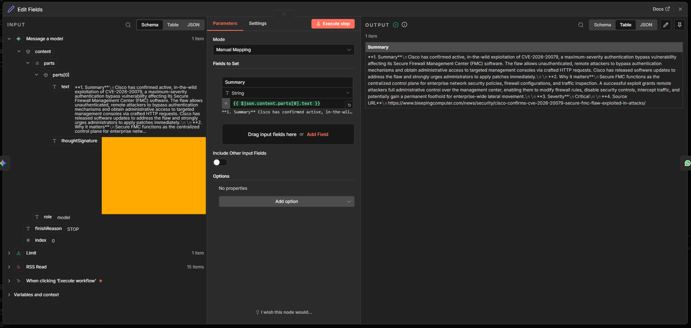
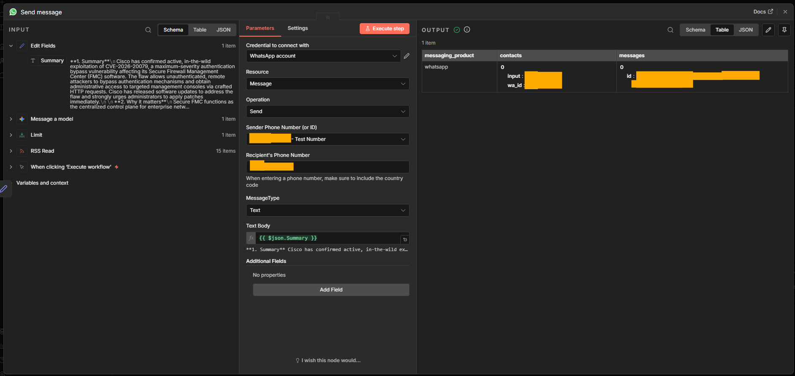

# Cybersecurity AI News Bot

An end-to-end cybersecurity news automation built with **n8n**, **Google Gemini**, and the **WhatsApp Cloud API**.

The workflow ingests cybersecurity news from BleepingComputer's RSS feed, sends each article to Google Gemini for summarization and severity assessment, cleans the model output, and delivers the resulting briefing to WhatsApp.

## What This Project Demonstrates

- Self-hosted workflow automation with n8n
- RSS ingestion and structured data handling
- Google Gemini API integration
- Prompt design and AI-assisted summarization
- Data transformation between workflow nodes
- WhatsApp Cloud API integration
- API authentication and troubleshooting
- End-to-end testing of a real external messaging workflow
- Secure handling of credentials and sanitized public artifacts

## Architecture

```text
BleepingComputer RSS
        |
        v
      n8n
        |
        v
   Limit Node
        |
        v
 Google Gemini
        |
        v
  Edit Fields
        |
        v
WhatsApp Cloud API
        |
        v
 Cybersecurity Briefing
```

See [`docs/architecture.md`](docs/architecture.md) for additional details.

## Workflow

The current MVP follows this sequence:

1. **Manual Trigger** — starts the workflow during testing.
2. **RSS Read** — retrieves cybersecurity articles from BleepingComputer.
3. **Limit** — controls how many RSS items are processed.
4. **Google Gemini** — summarizes the article and assigns a severity.
5. **Edit Fields** — extracts only the clean summary text needed downstream.
6. **WhatsApp Business Cloud** — sends the final briefing to WhatsApp.

## AI Prompt

Gemini is instructed to return:

- A 2–3 sentence technical summary
- Why the article matters
- Severity: Low, Medium, High, or Critical
- Source URL

## Screenshots

### 1. Workflow Overview


### 2. RSS Ingestion


### 3. Gemini Processing


### 4. Clean Output Transformation


### 5. WhatsApp Delivery


## Troubleshooting Highlights

During implementation, I worked through several real integration issues, including:

- Updating the n8n host configuration after a domain change
- Troubleshooting DNS and TLS/HTTPS issues in a Docker + Traefik deployment
- Recreating containers after configuration changes
- Resolving an unavailable Gemini model
- Working around Gemini free-tier request limits during testing
- Cleaning Gemini response metadata before downstream use
- Resolving a WhatsApp `401 Authorization failed` error caused by credentials
- Understanding the WhatsApp 24-hour customer-service messaging window
- Validating successful end-to-end message delivery

## Security Notes

The workflow JSON in this repository is **sanitized**.

It does **not** contain:

- API keys
- Access tokens
- Passwords
- n8n credential references
- Personal phone numbers
- WhatsApp account IDs
- Workflow or instance identifiers

Before importing the workflow, replace the placeholder values and create your own credentials inside n8n.

## Importing the Workflow

1. Install or access an n8n instance.
2. Import [`workflow/cybersecurity-ai-news-bot.json`](workflow/cybersecurity-ai-news-bot.json).
3. Create your own Google Gemini API credential in n8n.
4. Create your own WhatsApp Business Cloud credential.
5. Replace:
   - `YOUR_WHATSAPP_PHONE_NUMBER_ID`
   - `YOUR_RECIPIENT_PHONE_NUMBER`
6. Attach the credentials to the appropriate nodes.
7. Execute the workflow.

## Current Status

**MVP complete:** RSS content is successfully ingested, summarized by Gemini, transformed inside n8n, and delivered to WhatsApp.

## Planned Improvements

- Aggregate multiple articles into one daily briefing
- Reduce AI API calls by batching stories
- Add scheduled execution
- Add deduplication
- Add error handling and retry logic
- Improve message formatting
- Add workflow monitoring

## Technologies

- n8n
- Google Gemini
- WhatsApp Business Cloud API
- BleepingComputer RSS
- Docker
- Traefik
- Ubuntu VPS
